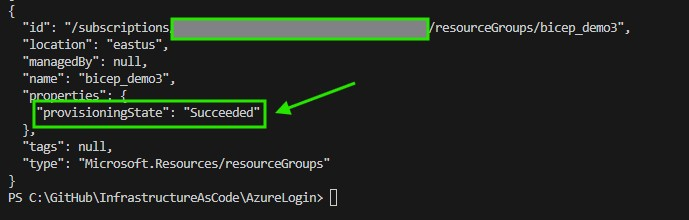
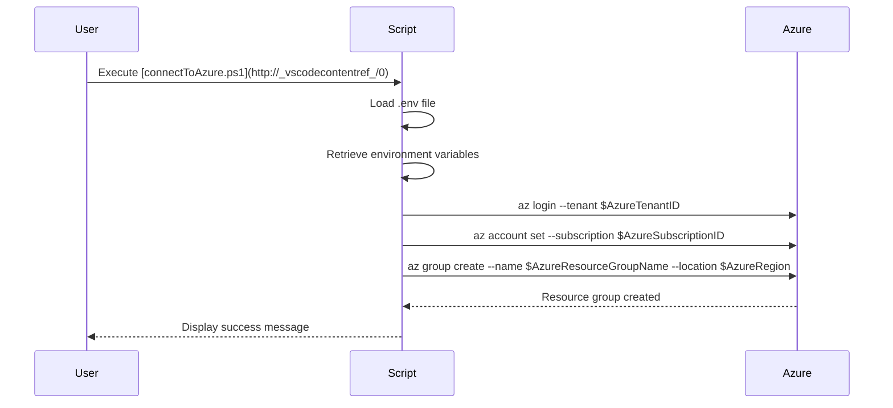
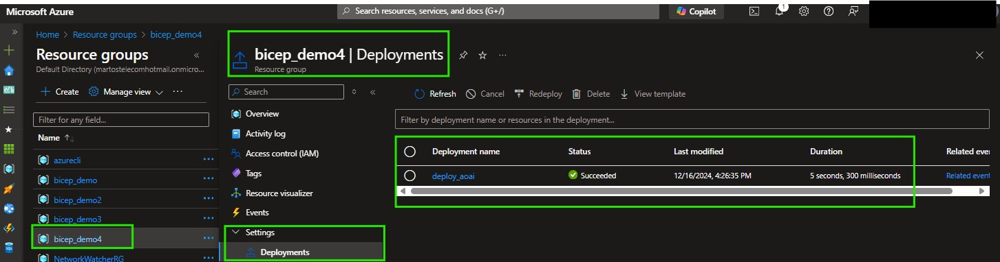
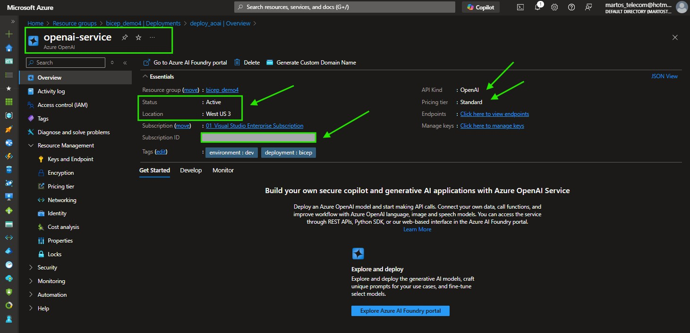
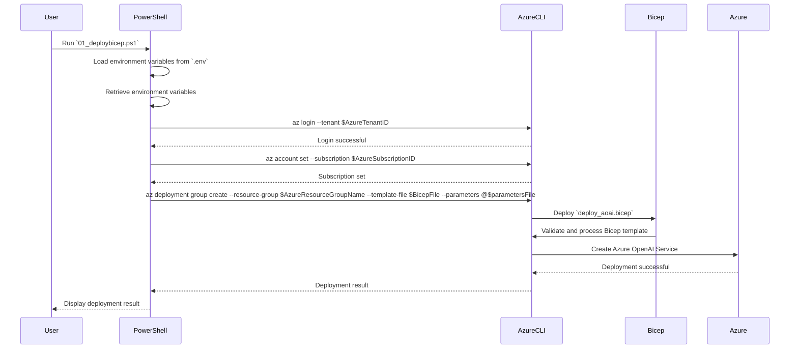

# Project: Deploy Azure OpenAI Service with Bicep Reusable Template

## Introduction

Welcome to the Azure Resource Deployment Automation project! 

This project aims to simplify and automate the process of deploying resources to Microsoft Azure using PowerShell scripts. 

By leveraging environment variables stored in a `.env` file, this project ensures a secure and efficient way to manage Azure resources. 




This foundational project is designed to help you understand and implement Azure Cloud Computing governance, security enforcement, and other critical aspects of cloud management.

## Table of Contents

- [Project: Deploy Azure OpenAI Service with Bicep Reusable Template](#project-deploy-azure-openai-service-with-bicep-reusable-template)
  - [Introduction](#introduction)
  - [Table of Contents](#table-of-contents)
  - [Key Concepts](#key-concepts)
  - [Skills Needed](#skills-needed)
  - [Project Overview](#project-overview)
    - [Features](#features)
  - [Setup Instructions](#setup-instructions)
  - [Execution](#execution)
  - [Diagrams](#diagrams)
    - [Sequence Diagram: Connect to Azure and Deploy a Resource Group](#sequence-diagram-connect-to-azure-and-deploy-a-resource-group)
  - [Using Bicep to Deploy Azure OpenAI Service](#using-bicep-to-deploy-azure-openai-service)
    - [What is Bicep?](#what-is-bicep)
    - [How to Use Bicep in This Project](#how-to-use-bicep-in-this-project)
    - [Bicep Template: `deploy_aoai.bicep`](#bicep-template-deploy_aoaibicep)
  - [Sequence Diagram: Logic Steps in `deploy_aoai.bicep` and `01_deploybicep.ps1`](#sequence-diagram-logic-steps-in-deploy_aoaibicep-and-01_deploybicepps1)

## Key Concepts

- **Azure Cloud Computing**: Understanding the basics of Azure services and resource management.
- **Environment Variables**: Securely managing sensitive information using environment variables.
- **PowerShell Scripting**: Automating tasks and resource deployment using PowerShell.
- **Governance and Security**: Implementing best practices for cloud governance and security.

## Skills Needed

- Basic knowledge of Azure services and resource management.
- Familiarity with PowerShell scripting.
- Understanding of environment variables and their usage.
- Basic knowledge of cloud governance and security principles.

## Project Overview

This project includes a PowerShell script (`connectToAzure.ps1`) that automates the process of logging into Azure, setting the subscription, and creating a resource group. The script reads environment variables from a `.env` file to securely manage sensitive information such as Azure Tenant ID and Subscription ID.

### Features

- Securely manage Azure credentials using environment variables.
- Automate Azure login and subscription setting.
- Create Azure resource groups with specified parameters.

## Setup Instructions

1. **Clone the Repository**: Clone this repository to your local machine.
2. **Create a .env File**: Create a `.env` file in the root directory with the following content:

    ```plaintext
    # Azure environment variables
    AZURE_TENANT_ID=your-tenant-id
    AZURE_SUBSCRIPTION_ID=your-subscription-id

    # Resource deployment variables
    AZURE_RESOURCE_GROUP_NAME=your-resource-group-name
    AZURE_DEPLOYMENT_REGION=your-deployment-region
    ```

3. **Install Azure CLI**: Ensure that the Azure CLI is installed on your machine. You can download it from [here](https://docs.microsoft.com/en-us/cli/azure/install-azure-cli).

## Execution

To execute the script, follow these steps:

1. Open a PowerShell terminal.
2. Navigate to the directory containing the `connectToAzure.ps1` script.
3. Run the script using the following command:

    ```powershell
    .\connectToAzure.ps1
    ```

## Diagrams

### Sequence Diagram: Connect to Azure and Deploy a Resource Group

This illustration shows how the script will deploy a resource group of your choice in the desired tenant and targeted Azure Subscription.



## Using Bicep to Deploy Azure OpenAI Service

### What is Bicep?

Bicep is a domain-specific language (DSL) for deploying Azure resources declaratively. It simplifies the process of defining and deploying Azure infrastructure as code.

### How to Use Bicep in This Project

This project includes a Bicep template (`deploy_aoai.bicep`) to deploy an Azure OpenAI Service. Follow the steps below to use Bicep for deployment:

1. **Ensure Prerequisites**:
    - Install Azure CLI: [Azure CLI Installation](https://docs.microsoft.com/en-us/cli/azure/install-azure-cli)
    - Install Bicep CLI: [Bicep CLI Installation](https://docs.microsoft.com/en-us/azure/azure-resource-manager/bicep/install)

2. **Setup Environment Variables**:
    - Create a `.env` file in the project root directory with the following content:
      ```plaintext
      AZURE_TENANT_ID=your-tenant-id
      AZURE_SUBSCRIPTION_ID=your-subscription-id
      AZURE_RESOURCE_GROUP_NAME=your-resource-group-name

3. **Run the Deployment Script**:
    - Open PowerShell and navigate to the directory containing `01_deploybicep.ps1`.
    - Run the script:
      ```powershell
      ./01_deploybicep.ps1
      ```

The commands located in the powershell file listed above uses Azure Command Line Azure CLI to deploy the resource via ARM services in the Azure portal.

Every deployment in this resource group can now be checked via cli but also via Azure Portal as seen below:



Once successfully deployed, you will be able to verify this automatic deployment via command line interface, and later also check this directly from the azure portal as illustrated below:



### Bicep Template: `deploy_aoai.bicep`

The Bicep template (`deploy_aoai.bicep`) is used to deploy an Azure OpenAI Service. Below is a snippet of the Bicep file:

## Sequence Diagram: Logic Steps in `deploy_aoai.bicep` and `01_deploybicep.ps1`

